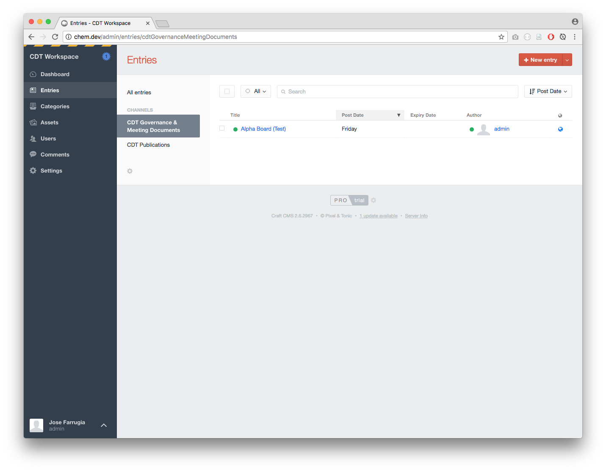
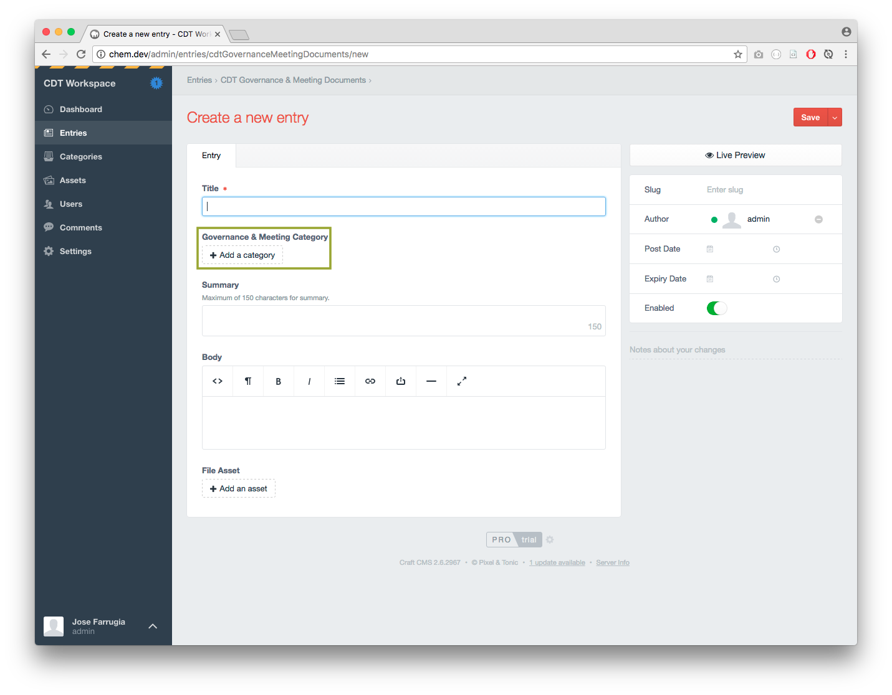
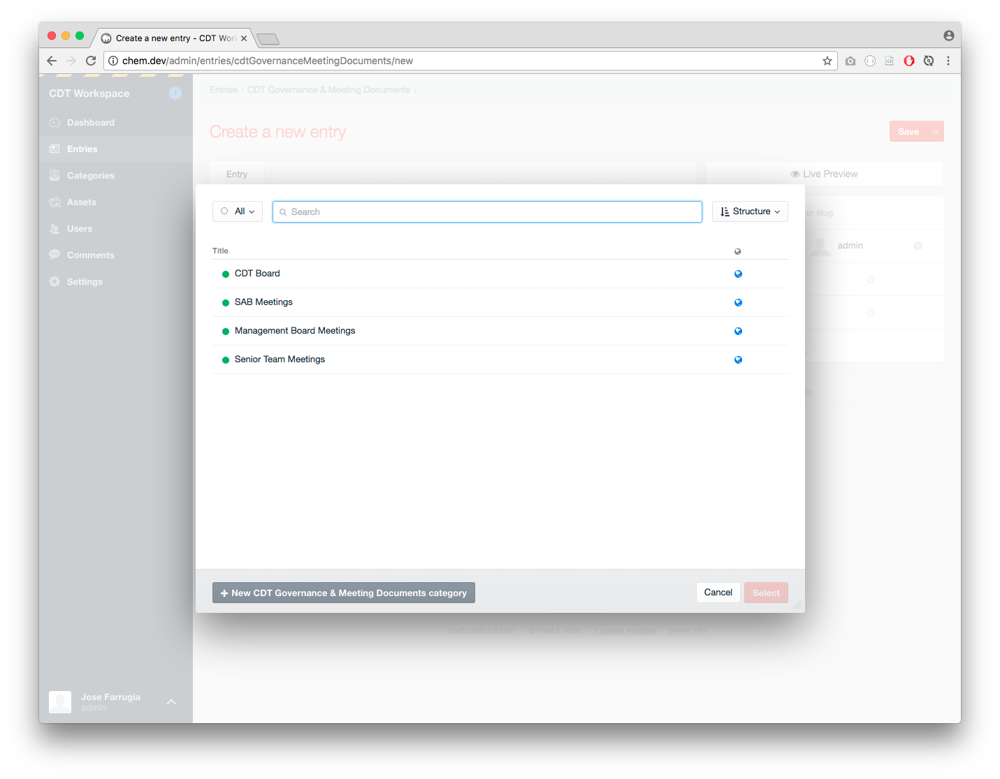
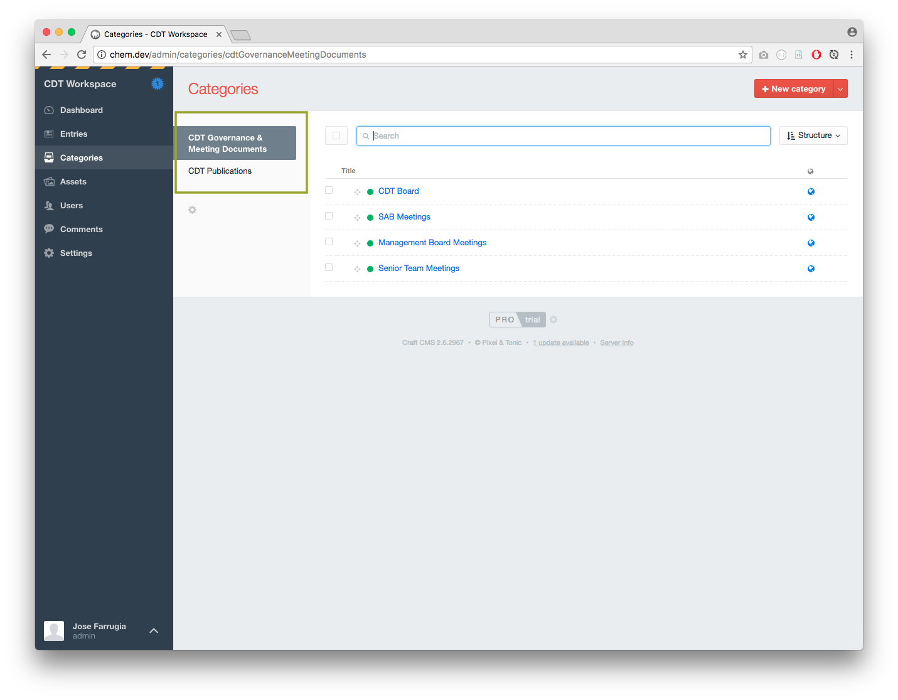
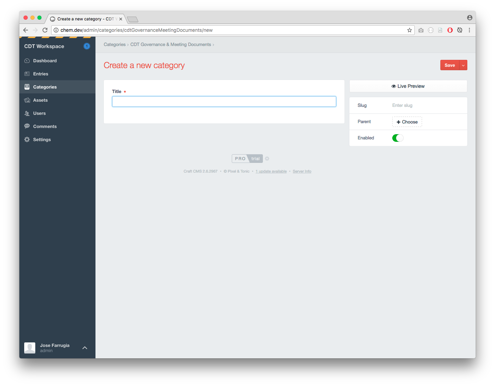
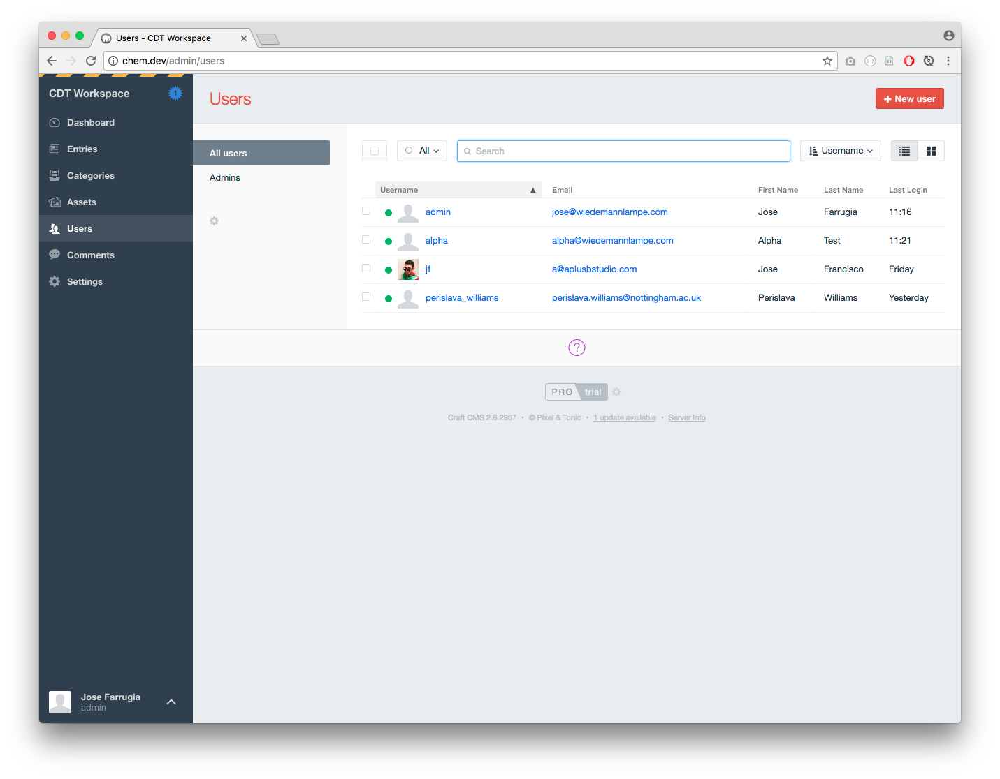
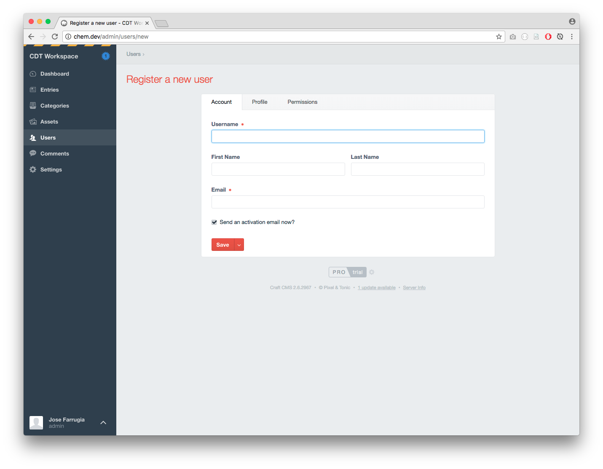
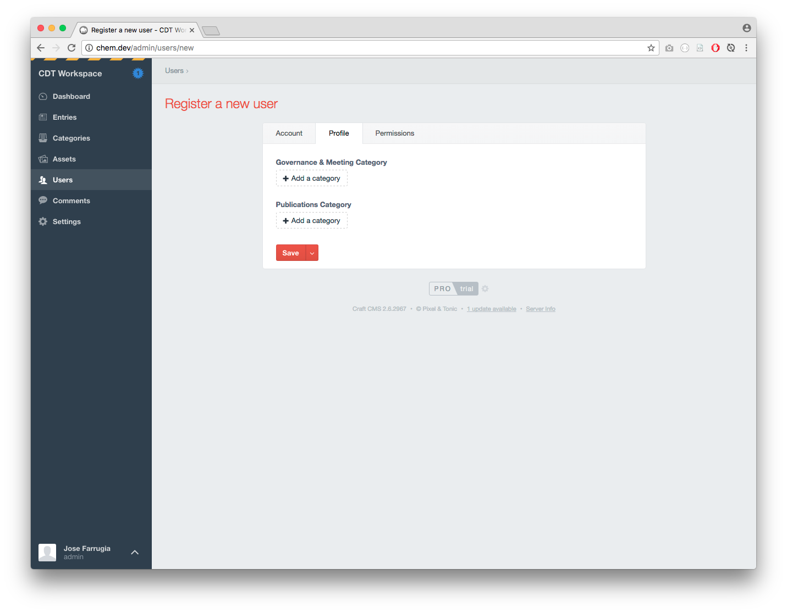
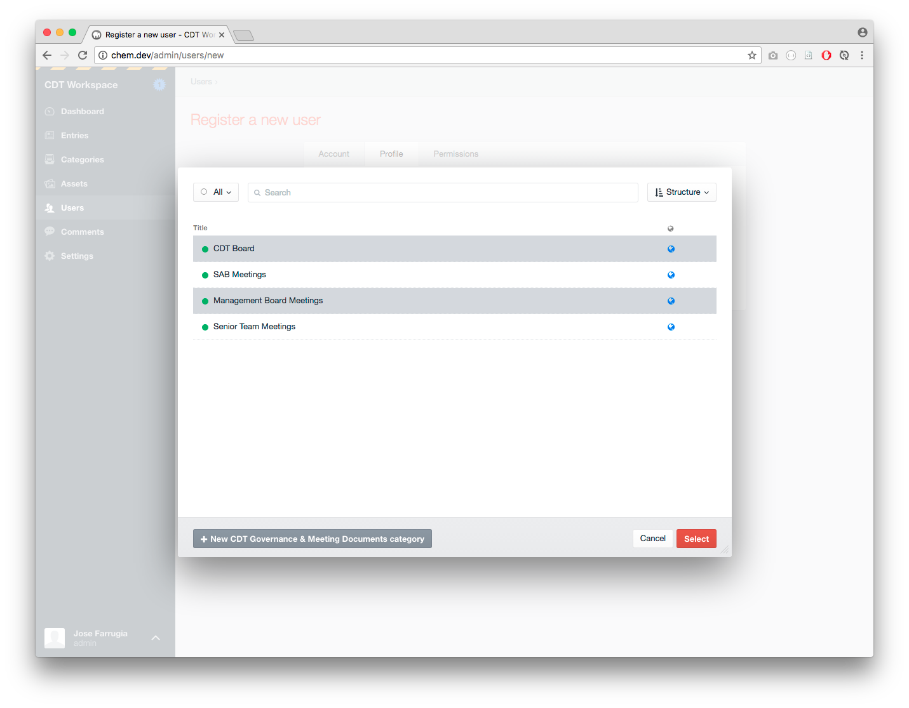
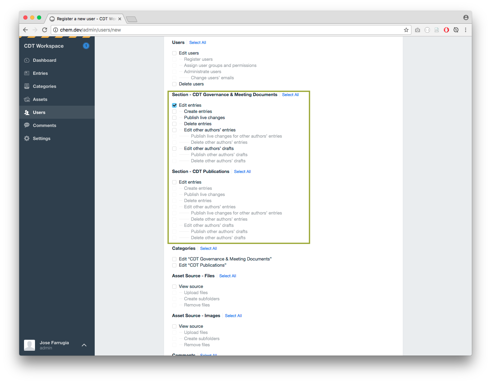

# CDT Workspace

Please send over any questions or queries to <jose@wiedemannlampe.com> at Wiedemann Lampe.

## Creating new content

1. Select __Entries__ from the left hand sidebar

2. Select the appropriate channel from the __Channel List__
3. Select __New entry__ from the top right hand corner
4. Input the respective fields making sure the right category has been added

5. Hit __Save__ on the top right hand corner

## Creating a sub section

1. Select __Categories__ from the left hand sidebar
2. Select the right __Category Group__

3. Hit __New category__ from the top right hand corner
4. Add the respective __Title__

## Creating a new user and assigning permissions to them

1. Select __Users__ from the left hand sidebar

2. Hit __New user__ from the top right hand corner
3. Input the respective fields

4. Select the __Profile__ tab

5. Select the __categories__ the user has access to. You can select multiple categories by pressing `Ctrl` or `CMD` on your keyboard. Hit __Select__.

6. Select the __Permissions__ tab
7. Tick the __Edit Entries__ of the __parent section__ so that the user has access to the section

